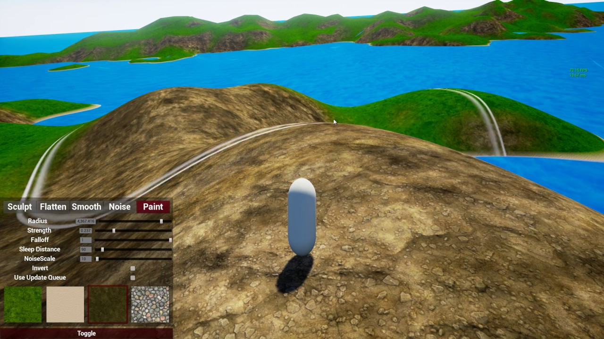

# TerrainEditor UE4
## Update Notice 2019: 
This project came to an abrupt halt around the end of 2016 when I lost alot of uncommited progress due to multiple harddrive failures. Since then I was able to restore some of the functionality. It's not alot and needs some refactoring but it will be released by the end of 2019 (including some documentation on how to use the Bluprint exposed API and how to setup your material to make it vertex paintable). \
Also for the people asking me for the license terms. I will re-release the project as a plugin with the MIT license. The main reason this hasn't happened yet are uncertainties regarding the inclusion of Epic Games example content textures. \

### About
- A set of components that makes terrain manipulation from within the game possible.
- It does not use unreal engines own landscape component. Instead it generates a procedural mesh that acts as the terrain. 
- Made with C++. 
- API exposed via Blueprint. Just add the "SculptComponent" to your player character and hook up the minimal API.
- Works with the ProceduralMeshComponent and the RuntimeMeshComponent.

### Example
Click on the image to see it in action on youtube:

[Forum Thread](https://forums.unrealengine.com/community/work-in-progress/96841-ingame-terraineditor-with-source)

### Getting Started:
- Make sure you have the RuntimeMeshComponent installed
- Clone or Download this project
- Right click the uproject file, select "Generate Visual Studio project files"
- Open the generated sln file, build it.
- launch unreal engine 

### Credits:
- Chris Conway (Koderz) - for the [RuntimeMeshComponent](https://github.com/Koderz/UE4RuntimeMeshComponent)
- Afan Olovcic (DevDad) -  for the [SimplexNoise Plugin](https://github.com/devdad/SimplexNoise)
